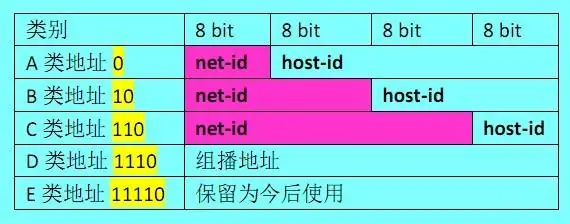

###### ip protocol 
* ip地址
```
ip(internet protocol address), 是ip协议提供的一种统一
的地址格式,它为互联网上的每一个网络和每一台主机分配一个逻辑地址,
以此来屏蔽物理地址的差异.
ip地址=网络地址+主机地址, 网络地址最高位必须是110
```

```
c类ip的地址范围: 192.0.0.0~223.255.255.255, 默认子网掩码为255.255.255.0
c类地址分配给小型网络, 如一般的局域网和校园网

c类ip的私有地址范围(私有地址就是在互联网上不使用,而被用在局域网络中的地址)
192.168.0.0 ~ 192.168.255.255

每个网络最多只能包含254台计算机. 
192.168.0.0是保留地址, 配合子网掩码代表了一段网络, 192.168.255.255是广播地址(主机位全为1)
如192.168.0.0/24, /24表示24个1组成的, 255.255.255.0的子网掩码, 表示
从左到右的24位有效,剩下的8位可以是任意数值,表示一个网段(子网)
```