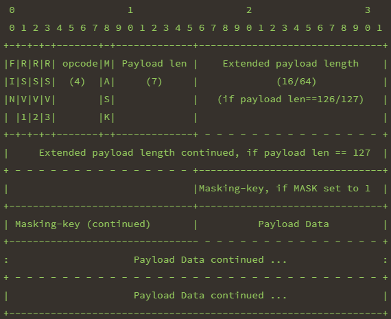
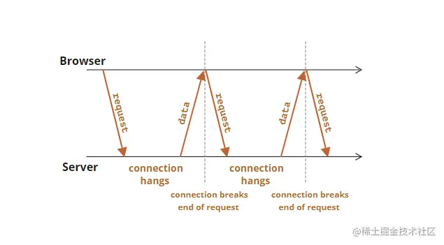

### websocket protocol
docs: 
1. [protocol upgrade mechanism](https://developer.mozilla.org/en-US/docs/Web/HTTP/Protocol_upgrade_mechanism)
2. [websocket](https://www.iana.org/assignments/websocket/websocket.xhtml)
3. [websocket protocol](https://www.rfc-editor.org/rfc/rfc6455.html)

#### 简介
websocket是建立在http协议上的全双工协议，在http协议上进行协议升级为websocket协议.
形式: ws://localhost:5000 wss://localhost:5000

适合场景: 双向通信和实时数据的情况.适合持续更新的情况，这是因为websocket低延迟，
因为tcp连接已经建立.最典型的是聊天应用.

客户端发送websocket握手:
```http
Connection: Upgrade
Upgrade: websocket
Sec-Websocket-Extensions: xxx 
Sec-Websocket-Key: bas64编码key
Sec-Websocket-Version: 13
```

**升级到websocket连接
WebSocket()构造器做了所有的工作: 创建一个初始的HTTP/1.1连接，然后处理握手和升级步骤.
```js
webSocket = new WebSocket("ws://destination.server.ext", "optionalProtocol");
```

___

#### Websocket-Specific headers

##### Sec-WebSocket-Extensions
指定一个或多个websocket扩展让服务端使用.
```http
Sec-WebSocket-Extensions: extensions
```
extensions用逗号分隔，可以使用分号给拓展传递参数.
eg:
```http
Sec-WebSocket-Extensions: superspeed, colormode; depth=16
```

下面两种是等价的:
```http
Sec-WebSocket-Extensions: foo, bar; baz=2
```

```http
Sec-WebSocket-Extensions: foo
Sec-WebSocket-Extensions: bar; baz=2
```

##### Sec-WebSocket-Key
提供给服务端用于确认客户端有资格将请求提升为websocket.
```
Sec-WebSocket-Key: 使用websocket规范中的算法计算出的key
```

##### Sec-WebSocket-Protocol
按照偏好顺序指定要使用的websocket协议，第一个被服务端支持将会被选中并且
在响应头Sec-WebSocket-Protocol返回.
```
Sec-WebSocket-Protocol: subprotocols
```

subprotocols可以在下面列表中选取，也可以自定义.
[subprotocols](https://www.iana.org/assignments/websocket/websocket.xml#subprotocol-name)

##### Sec-WebSocket-Version
指定客户端期望使用的websocket协议版本，服务端从而可以确认是否自己是否支持.
websocket协议最新的最终版本是13.
```http
Sec-WebSocket-Version: version
```

如果服务端不使用客户端指定的版本，则返回错误(如426 Upgrade Required)，并且在响应中使用
Sec-WebSocket-Version头，说明自己支持的协议版本列表(逗号分割).如果服务端支持请求的协议版本，则响应中
不携带Sec-WebSocket-Version头.
```http
Sec-WebSocket-Version: supportedVersions
```

##### Sec-WebSocket-Accept
在打开握手步骤，当服务端同意初始化websocket连接，服务端的响应会包含此头.
服务端响应客户端的握手请求后，客户端验证握手响应:
1. 客户端检查响应状态码是否为101 
2. 检查Connection、Upgrade头信息以
确保服务器确认升级到websocket协议
3. 验证Sec-WebSocket-Accept与字节的key+258EAFA5-E914-47DA-95CA-C5AB0DC85B11进行SHA-1哈希而后Base64
编码结果比较
4. 相同则握手成功，否则握手失败

服务器响应握手请求: 
```http
Request URL: ws://localhost:1234/
Request Method: GET
Status Code: 101 Switching Protocols
Connection: Upgrade
Upgrade: websocket
Sec-WebSocket-Accept: hash
```
hash是客户端提供的key+字符串258EAFA5-E914-47DA-95CA-C5AB0DC85B11，SHA-1哈希生成
20字节值，然后base64编码获取此属性的值.


上面说明的是open handshake，还有close handshake
服务端或者客户端发送close frame，然后对应方响应自己的close frame，然后关闭tcp连接.

##### 258EAFA5-E914-47DA-95CA-C5AB0DC85B11
此固定字符串为websocket协议约定的magic number，用来过滤不支持此协议的包.

___
#### 握手流程总结
客户端发送WebSocket握手请求：
当客户端想要建立WebSocket连接时，它会发送一个HTTP请求到服务器。这个请求通常称为握手请求，
其中包含一些特定的头信息（Upgrade，Connection，Sec-WebSocket-Key，Sec-WebSocket-Version）来指示客户端希望升级到WebSocket协议


服务器响应握手请求：
服务器接收到客户端的握手请求后，会进行一些验证协议、请求方法和Upgrade，Connection等信息头，
并且生成Sec-WebSocket-Accept。如果服务器支持WebSocket协议，并且验证通过，它将返回一个带有101状态码的http响应，称为握手响应


握手响应确认：
客户端收到服务器的握手响应后，会验证响应中的一些头信息（例如Sec-WebSocket-Accept等），以确保握手成功。如果验证通过，客户端将确认握手成功


建立WebSocket连接：
一旦握手成功确认，WebSocket连接就被建立。此时，客户端和服务器之间的连接将从HTTP协议升级为WebSocket协议


双向数据传输：
通过建立的WebSocket连接，客户端和服务器可以进行双向数据传输。它们可以使用WebSocket API发送和接收消息，实现实时的双向通信


#### 握手结束后使用特定格式的帧通信
**帧格式**




#### 持续更新数据策略

##### 实时通信场景
1. 聊天应用(Chat App)
2. 多用户游戏(Multiplayer Game)
3. 多用户同时编辑文档(Google Docs)
4. 进度展示(Progress Status)


思路: TCP/UDP、HTTP/WS

##### http轮询
轮询是客户端与服务器保持持久连接的最简单的方式
这两种方式都是pull的方式，服务器不能主动发起对话，不能将消息推送到客户端或者广播到客户端.

**常规轮询(short polling)**
常规轮询简单的实现了每隔几秒向服务器发起请求来查看状态是否改变
客户端设置timer，每interval seconds去发送get请求轮询服务器，服务器从数据库查询最新的数据.

缺点: 
1. 消息传递的延迟最多为 interval 秒(两个请求之间)----高延迟(High latency)

2. 即使没有消息，服务器也会每隔 interval 秒被请求轰炸一次
，即使用户切换到其他地方或者处于休眠状态，也是如此.
就性能而言，这是一个很大的负担.


**长轮询(long polling)**
长轮询本质上是pull，但是在客户端发起请求时，服务端不会马上返回，而是保持该链接

1. 浏览器发送请求
2. 服务器接收后挂起，在没有改变的消息之前不会关闭连接
3. 服务器查询到消息改变后返回到浏览器
4. 浏览器重新发起请求

##### 服务器发送事件(Server-sent events)
> [Server-sent events](https://www.ruanyifeng.com/blog/2017/05/server-sent_events.html)

SSE在服务器和客户端之间打开一个单向通道(Only Server->Client: Read Only)，服务端响应的不再是一次性的数据包而是text/event-stream类型的数据流信息，在有数据变更时从服务器流式传输到客户端

SSE与WebSocket作用相似，都可以建立服务端与浏览器之间的通信，实现服务端向客户端推送消息，但还是有些许不同:

SSE 是基于HTTP协议的，它们不需要特殊的协议或服务器实现即可工作;WebSocket需单独服务器来处理协议
SSE 单向通信，只能由服务端向客户端单向通信;webSocket全双工通信，即通信的双方可以同时发送和接受信息
SSE 实现简单开发成本低，无需引入其他组件;WebSocket传输数据需做二次解析，开发门槛高一些
SSE 默认支持断线重连;WebSocket则需要自己实现
SSE 只能传送文本消息，二进制数据需要经过编码后传送;WebSocket默认支持传送二进制数据


**客户端API**

检测浏览器是否支持SSE
```js
// window是否有EventSource属性
if ('EventSource' in window) {
  // ...
}
```

创建EventSource实例
```js
// withCredentials表示是否一起发送Cookie
var source = new EventSource(url, { withCredentials: true });
````
EventSource实例的只读属性readyState，用来表明连接的当前状态，该属性只读.
```txt
0：相当于常量EventSource.CONNECTING，表示连接还未建立，或者断线正在重连。
1：相当于常量EventSource.OPEN，表示连接已经建立，可以接受数据。
2：相当于常量EventSource.CLOSED，表示连接已断，且不会重连。
```

连接建立会触发open事件，在onopen属性定义回调函数
```js
// addEventListener第三个参数useCapture表示在捕获过程还是冒泡过程执行时间处理函数.
// 捕获过程eg: window->document->body->div 冒泡过程eg: div->body->document->window
source.onopen = function (event) {
  // ...
};

// 另一种写法
source.addEventListener('open', function (event) {
  // ...
}, false);
```

客户端收到服务器发来的数据，会触发message事件，可以在onmessage属性定义回调函数
```js
// event.data为服务端传回的文本数据
source.onmessage = function (event) {
  var data = event.data;
  // handle message
};

// 另一种写法
source.addEventListener('message', function (event) {
  var data = event.data;
  // handle message
}, false);
```

如果发生通信错误(比如连接中断)，就会触发error事件，可以在onerror属性定义回调函数.
```js
source.onerror = function (event) {
  // handle error event
};

// 另一种写法
source.addEventListener('error', function (event) {
  // handle error event
}, false);
```

客户端关闭SSE连接
```js
source.close()
```


客户端监听自定义事件
```js
// 服务端发送的event: foo消息，浏览器监听foo事件.
source.addEventListener('foo', function (event) {
  var data = event.data;
  // handle message
}, false);
```

**服务器实现**
数据格式
服务器向浏览器发送的 SSE 数据，必须是 UTF-8 编码的文本，具有如下的 HTTP 头信息:
```http
Content-Type: text/event-stream
Cache-Control: no-cache
Connection: keep-alive
```

每一次发送的信息，由若干个message组成，每个message之间用\n\n分隔.
每个message内部由若干行组成，每一行都是如下格式
```text
[field]: value\n
```

field取值范围:
data 数据内容
event 表示自定义的事件类型，默认为message事件.
id 数据标识符(编号)
retry 浏览器重新发起连接的时间间隔
两种情况会导致浏览器重新发起连接：一种是时间间隔到期，二是由于网络错误等原因，导致连接出错

此外还可以有冒号开头的行，表示注释(通常，服务器每隔一段时间就会向浏览器发送一个注释，保持连接不中断)
```text
: This is a comment
```

eg:
```txt
GET http://localhost:8000/progress

Header: 
	Content-Type: text/event-stream 
	Cache-Control: no-cache

Body: 
	id: 1
	event: onProgress
	data: {"progressPercentage": 10}

	id: 2
	event: onProgress
	data: {"progressPercentage": 15}

	id: 3
	event: onProgress
	data: {"progressPercentage": 20}
```

##### websocket