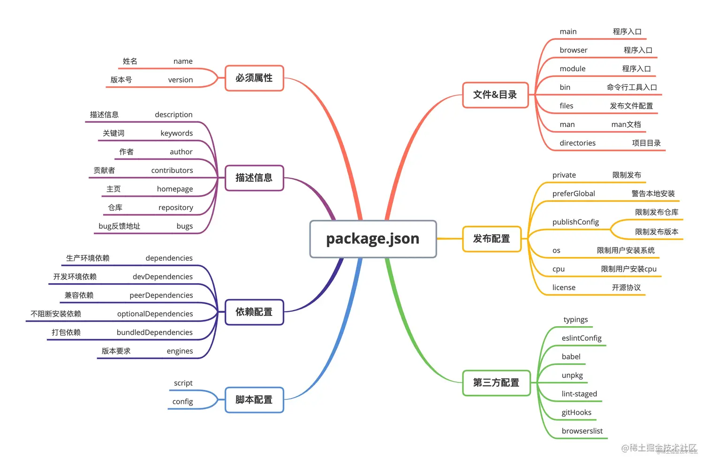

##### npm

* npm基本命令
查看npm版本号 npm -v
查看npm命令列表 npm help
查看npm的配置 npm config list --json
清除npm本地缓存 npm cache clean

* package安装和更新

**本地安装**
会先生成package.json文件，然后安装的时候包的版本会自动记录在该文件中.
本地安装的包又分为开发依赖(devDependencies)和生产依赖(dependencies)
开发依赖: npm install xx --save-dev(或-D)
生产依赖: npm intall xx --save(或-S) 
不想把包放在开发或生产依赖: npm install xx --no-save
如果没有传递依赖参数据，则会默认安装到生产依赖(dependencies)中

npm install package 
npm install pacakge@version
npm uninstall jquery -g
npm update jquery -g

*  查看本地全局安装的package
npm ls

* 查看本地全局安装的jquery信息
npm ls jquery -g
查看更加全面的信息 npm info jquery

* 查看npm服务器上最新的jquery版本信息
npm view jquery version

* 查看npm服务器上所有的jquery版本信息
npm view jquery versions

* npm配置
npm config get proxy
npm config set proxy=http://xxx
npm config set registry https://registry.npm.taobao.org -g

###### npm配置文件.npmrc(npm running configuration)
> 可以设置package.json中依赖包的安装来源,即从哪里下载依赖包

* .npmrc配置文件的优先级
电脑中有多个 .npmrc 文件，在我们安装包的时候，npm按照如下顺序读取这些配置文件

```
项目配置文件: /project/.npmrc

npm config get userconfig
用户配置文件：~/.npmrc

npm config get prefix
全局配置文件： $PREFIX/etc/npmrc

which npm 
npm 内置配置文件 E:\nodejs\node_modules\npm\.npmrc
```


##### npm创建项目
```shell
mkdir demo 
# 生成package.json
# 如包名称、版本号、作者信息、入口文件、仓库地址、关键字、描述、许可协议等
npm init 	
npm install xxx --saved-dev
```

npm init会自动生成package.json文件,npm install会自动生成package-lock.json文件
**package.json文件**

项目的配置文件，常见的配置有配置项目启动、打包命令，声明依赖包等
是一个JSON对象，该对象的每一个成员就是当前项目的一项设置

**package-lock.json文件**
package-lock.json里面定义的是某个包的具体版本，以及包之间的层叠关系

一个 package-lock.json 里面的每个依赖主要是有以下的几部分组成的:
Version: 依赖包的版本号
Resolved: 依赖包的安装源(其实就是可以理解为下载地址)
Intergrity: 表明完整性的 Hash 值
Dev: 表示该模块是否为顶级模块的开发依赖或者是一个的传递依赖关系
requires: 依赖包所需要的所有依赖项,对应依赖包 package.json 里 dependencices 中的依赖项
dependencices: 依赖包 node_modeles 中依赖的包(特殊情况下才存在)
并不是所有的子依赖都有<dependencies>属性,只有子依赖的依赖和当前已安装在根目录的<node_modules>中的依赖冲突之后, 
才会有这个属性.这可能涉及嵌套情况的依赖管理

package-lock.json文件锁定安装时的包的版本号，并且需要上传到git，以保证其他人在npm install时大家的依赖能保证一致.
package.json只能锁定大版本.

###### vue-cli

* vue-cli2初始化项目
```
npm install webpack
npm install webpack-cli
npm install webpack-dev-server
npm install -g vue-cli
vue init webpack project
cd heprojecto
npm install
npm run dev
```
